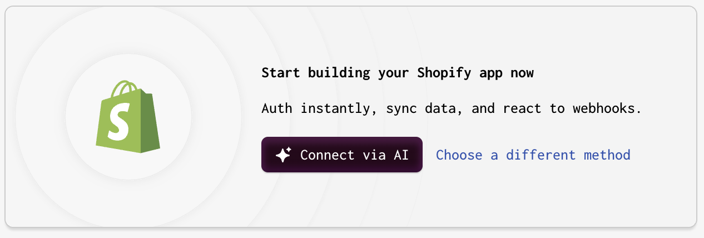
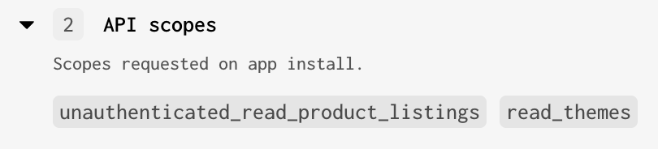
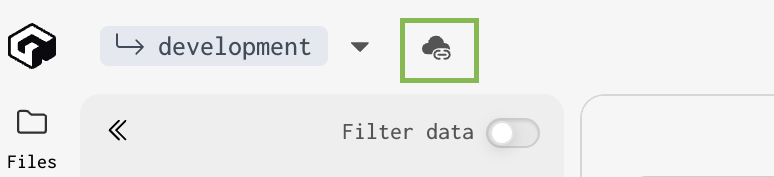
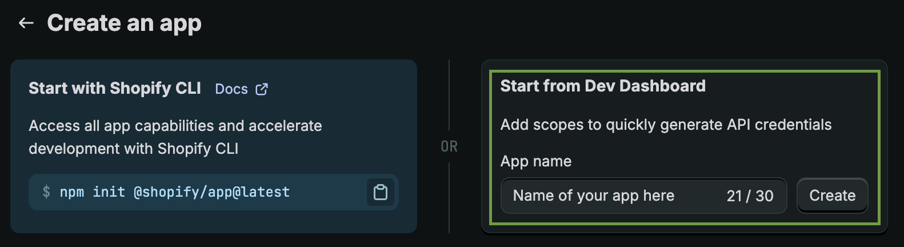

First, let's add Brush to a Gadget app. This adds context enhancements, Shopify Storefront API token, localization info and so on.

> If you already have an existing Gadget app, you can jump to [Add Brush to an existing Gadget app](#add-brush-to-an-existing-gadget-app)

## Sign up to gadget.dev and init app

- Head to <a href="https://gadget.dev/" title="gadget.dev" target="_blank">gadget.dev</a>.
- Click on the "Create app" button and follow the login process.
- Once landed on your main Gadget dashboard, click on the "+ Create app" button.
- On the "Create new app" page, make sure to choose "Shopify app" and an app type of "Custom app" and continue (those should be the defaults).
- Set an app name of your choice and keep the default options (Frontend: React Router v7 framework mode ; Language: Typescript). And confirm.

## Add the Shopify plugin

- On the main pane of your Gadget app admin, you should see this:

- Select "Choose a different method".
- Then, choose "Use different connection methods".
- Keep the default configuration and continue without further ado.
- Make sure to check "Read" for both "[Admin API] Themes" and "[Storefront API] Product listings".

The "API scopes" section in the right column must look like that:

- Confirm. This shows up a modal box that you can close straight ahead.
- Do not worry about the "Install your app on a dev store" warning that shows up, we'll come to it later.

## Install the Brush backend app

> ⚠️ **Make sure you do have Yarn installed as Gadget uses it instead of npm.**

- Go to a terminal and `cd` to the folder in which you want to install and run your backend app.
- In the top left corner of your Gadget app admin, look for the icon that shows a cloud with a link.

- Run the 2 commands and, for the second one (`ggt dev ...`), wait for the setup to run and `Waiting for file changes…` to show in the terminal.
- Kill the command so that `Waiting for file changes…` is stopped and you get access back to the terminal prompt.
- `cd` into the subfolder that was created during `ggt dev...`.
- Run `npm create brush@latest`
- Choose "Backend" and continue
- Use `.` for the "In which relative directory to install?" question and let the Brush installer run.
- Run `ggt dev` in order to relaunch the Gadget app. You may see errors in the output but this is normal as Gadget must install new dependencies ; which it will do automatically.

## Create a Shopify custom app and link it to the Gadget app

- From your Shopify partners' dev dashboard, choose "Create app"
- Use the "Start from Dev Dashboard" option and fill the "App name" field with a name for your Shopify app

- Back to your Gadget admin dashboard, click on the "Settings" icon in the lower left corner
- Then choose "Plugins" in the left column
- Your should see a "Shopify" active connection stating "Incomplete connection setup". Click on it.
- In the "Connected apps" box, you should have a "Unknown handle" entry. Click on it to show its details.
- Copy both "App URL" and "App redirection URLs".
- Back to your Shopify app setup...
- ... paste the Gadget's "App URL" into the "App URL" entry in the "URLs" box
- And paste the Gadget's "App redirection URLs" 
## Add Brush to an existing Gadget app 