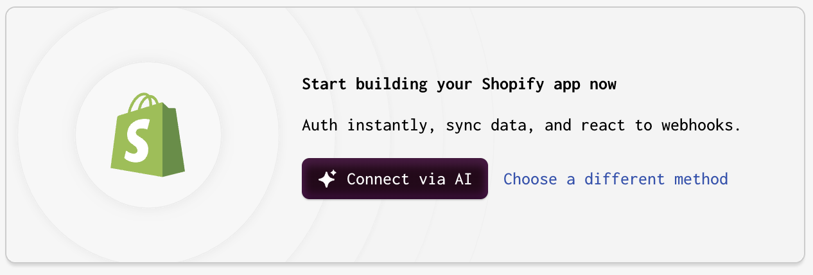
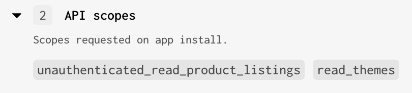
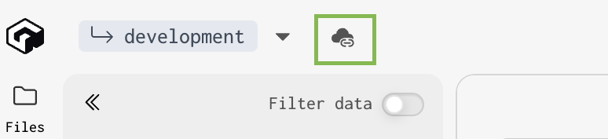
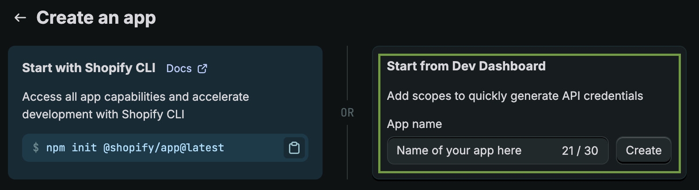
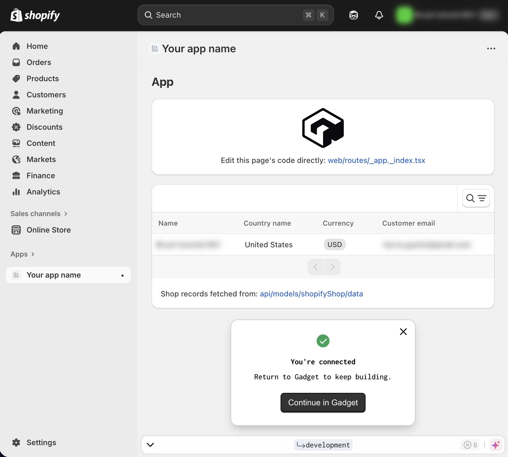

First, let's add Brush to a Gadget app. This adds context enhancements, Shopify Storefront API token, localization info and so on.

> If you already have an existing Gadget app, you can jump to [Add Brush to an existing Gadget app](#add-brush-to-an-existing-gadget-app)

## Sign up to gadget.dev and init app

- Head to <a href="https://gadget.dev/" title="gadget.dev" target="_blank">gadget.dev</a>.
- Click on the "Create app" button and follow the login process.
- Once landed on your main Gadget dashboard, click on the "+ Create app" button.
- On the "Create new app" page, make sure to choose "Shopify app" and an app type of "Custom app" and continue (those should be the defaults).
- Set an app name of your choice and keep the default options (Frontend: React Router v7 framework mode ; Language: Typescript). And confirm.

## Add the Shopify plugin

- On the main pane of your Gadget app admin, you should see this:

- Select "Choose a different method".
- Then, choose "Use different connection methods".
- Keep the default configuration and continue without further ado.
- Make sure to check "Read" for both "[Admin API] Themes" and "[Storefront API] Product listings".

The "API scopes" section in the right column must look like that:

- Confirm. This shows up a modal box that you can close straight ahead.
- Do not worry about the "Install your app on a dev store" warning that shows up, we'll come to it later.

## Install the Brush backend app

> ⚠️ **Make sure you do have Yarn installed as Gadget uses it instead of npm.**

- Go to a terminal and `cd` to the folder in which you want to install and run your backend app.
- In the top left corner of your Gadget app admin, look for the icon that shows a cloud with a link.

- Run the 2 commands and, for the second one (`ggt dev ...`), wait for the setup to run and `Waiting for file changes…` to show in the terminal.
- Kill the command so that `Waiting for file changes…` is stopped and you get access back to the terminal prompt.
- `cd` into the subfolder that was created during `ggt dev...`.
- Run `npm create brush@latest`
- Choose "Backend" and continue
- Use `.` for the "In which relative directory to install?" question and let the Brush installer run.
- Run `ggt dev` in order to relaunch the Gadget app. You may see errors in the output but this is normal as Gadget must install new dependencies ; which it will do automatically.

## Create a Shopify custom app and link it to the Gadget app

- From your Shopify partners' dev dashboard, choose "Create app"
- Use the "Start from Dev Dashboard" option and fill the "App name" field with a name for your Shopify app

- Back to your Gadget admin dashboard, click on the "Settings" icon in the lower left corner
- Then choose "Plugins" in the left column
- Your should see a "Shopify" active connection stating "Incomplete connection setup". Click on it.
- In the "Connected apps" box, you should have a "Unknown handle" entry. Click on it to show its details.
- Click on the "Remove app" button. This removes this entry and redirects you back to the previous page.
- Click "Connect manually" and leave this page opened.
- Copy both "App URL" and "App redirection URLs".
- Back to your Shopify app setup...
- ... paste the Gadget's "App URL" into the "App URL" entry in the "URLs" box
- And paste the Gadget's "App redirection URLs" into the "Redirect URLs" textarea of the "Access" box.
- Make sure to check the "Use legacy install flow" just above.
- Deploy the "App Proxy" box at the bottom and choose "apps" for the "Subpath prefix", "brush" for the "Subpath"...
- ... for the "Proxy URL": use the main URL from the Gadget's "App URL" and happen `/brush`. For example, if your Gadget's "App URL" is `https://brush-tutorial--development.gadget.app`, the "Proxy URL" value must be `https://brush-tutorial--development.gadget.app/brush`.
- Click the "Release" button at the top of the Shopify "Create a version" page you are currently browsing, enter any detail you wish in the modal that appears and confirm the release by clicking "Release".
- Reach out to the "Settings" page of your Shopify app and copy both "Client ID" and "Secret".
- Back to your Gadget app admin, paste the Client ID into "Client ID" and the Secret into "Client secret".
- Save the Gadget configuration and close the modal that appears.
- Still from the "Settings" page of your Gadget app (you should alrady be browsing it, otherwise click on the Settings with a gear icon at the bottom left), choose "Environnement variables" and add a new entry with the Key `SHOPIFY_APP_CLIENT_SECRET` and paste the "Secret" you got from your Shopify app "Settings" page earlier.

## Install your app on a Shopify store

- From your Shopify dev dashboard, reach out to the "Dev stores" page and create a new dev store of your choice.
- Follow the process to install your app on an available store.
- Now, reach out to the "Apps" page and choose your Shopify app.
- Click on the "Install app" button of the "Installs" box and follow the process by choosing the dev store you just created.
- You should now have your Shopify app powered by Gadget in your dev store's admin 🎉

---

## Add Brush to an existing Gadget app

- From a terminal, `cd` into your Gadget installation directory.
- Kill any running `ggt dev` process.
- Run `npm create brush@latest`
- Choose "Backend" and continue
- Use `.` for the "In which relative directory to install?" question and let the Brush installer run.
- Run `ggt dev` in order to relaunch the Gadget app. You may see errors in the output but this is normal as Gadget must install new dependencies ; which it will do automatically.