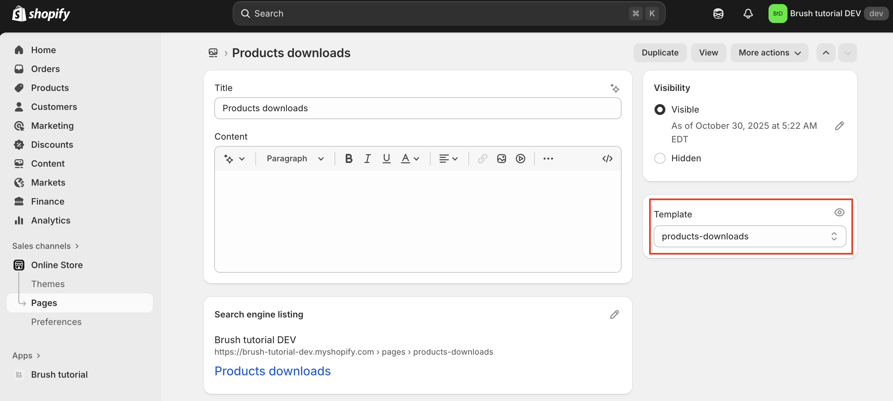

import { Badge } from '@astrojs/starlight/components';

Let's create the "Products downloads" page that will host our content.

## Frontend code update
<Badge text='See commit "Page setup"' variant="tip" />

In the commit, you will see:

- A new page template JSON definition cloned from the `Default page` template as a starter.
- The addition of a new link in the header that targets a dedicated `Products downloads` page of the online store.

You know need to create this page and make it use the new page template.

## Online store page

Create the page and use the new `products-downloads` template.

