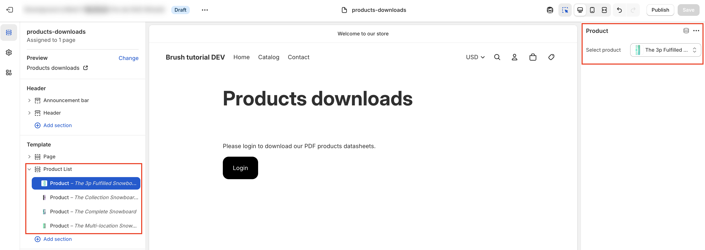
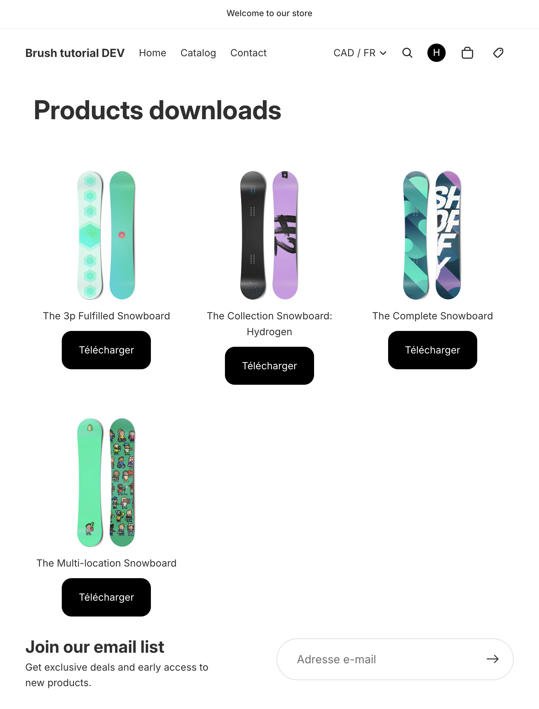

import { Badge } from '@astrojs/starlight/components';

We can now update our Shopify section to enable merchant contribution (adding products to download) and display them on the "Products downloads" page.

## Frontend code update
<Badge text='See commit "Products grid layout"' variant="tip" />

- Update the section schema to add the ability to contribute downloadable products to be displayed on the frontend.
- Update the section Liquid code to display the actual products grid.
- Update the Shopify page template and introduce a new `products-downloads.liquid` section.
- Handle the case where the merchant does not contribute products.
- Also make sure to update JSON translation files.

## Contribution

The merchant can you contribute products to be downloadable.

## Frontend result

Here is an example of how the "Products downloads" page may look like once contributed (in French).

